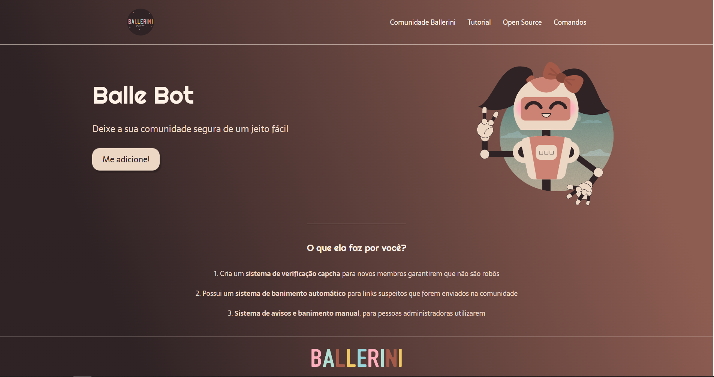

# 🤎 BalleBot - LadingPage

BR: Este é um projeto de estudo executado acompanhando um [tutorial no Youtube](https://www.youtube.com/watch?v=llF6vD-RljE&t=1557s) feito pela [@rafaballerini](https://github.com/rafaballerini).

EN: This is a study project based on a [tutorial on Youtube](https://www.youtube.com/watch?v=llF6vD-RljE&t=1557s) made by [@rafaballerini](https://github.com/rafaballerini).

## 🤎 Screenshots
#### Desktop 
 

## 🤎 Preview site
[Clique aqui | Click here](https://nicoledpizetta.github.io/BalleBot-LadingPage/)

## 🤎 Tecnologias usadas | Technologies used
- Semantic HTML5 markup
- CSS custom properties
- Flexbox

## 🤎 Autor | Author
- GitHub - [@NicoleDPizetta](https://github.com/NicoleDPizetta)
- LinkedIn - [@nicoledpizetta](https://www.linkedin.com/in/nicoledpizetta/)

## 🤎 Agradecimentos | Acknowledgments
BR: Agradeço imensamente à [@rafaballerini](https://github.com/rafaballerini) por disponibilizar conteúdos tão relevantes para quem está estudando e por explicar as coisas de uma maneira tão simples de entender. Realmente adorei acompanhar seu tutorial, aprendi muito com ele e o resultado ficou incrível. 🥰

EN: I am immensely grateful to [@rafaballerini](https://github.com/rafaballerini) for providing such relevant content for those who are studying and for explaining things in such a simple way to understand. Really loved following your tutorial, I learned a lot from it and the result was amazing. 🥰

---------------

### 
💖 Obrigada por ler até aqui | Thanks for reading this far 💖
